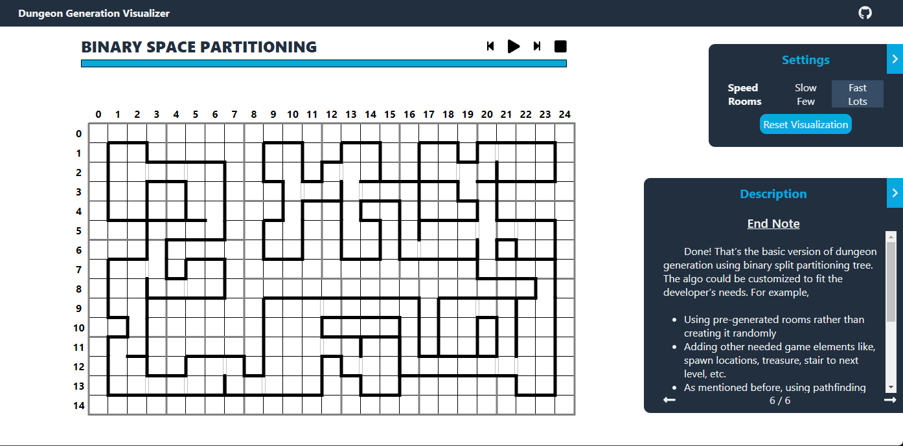

# dungeon-generation-visualizer

A college project used to learn Reactjs. 

The web page provides a step-by-step walkthrough of Binary Space Partition(BSP) algorithm. Each step is described and visualized, aimed to teach users about the algorithm. 

The algorithm used is particularly modified to simulate the creation of dungeons in rogue-like games, as such it is visualized in 2D and made to have a single but branching path.

BSP itself is one of the basic algorithms used to generate random dungeons, which was used in Doom(1993) and Quake(1996).

URL: https://marceljulian.github.io/dungeon-generation-visualizer/

